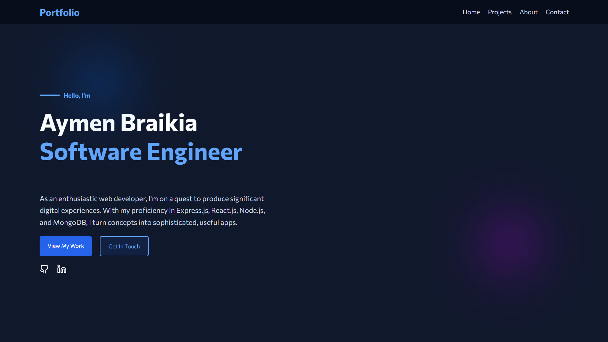
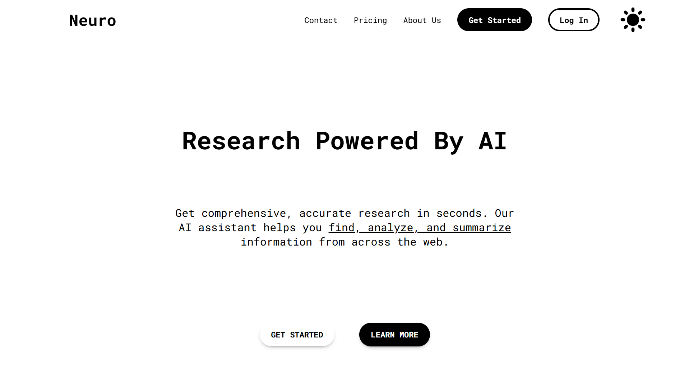
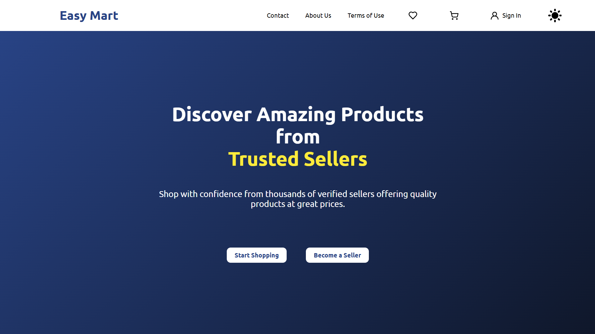

<h1 align="left">Hi 👋! I'm Aymen a Fullstack Developer, from Algeria</h1>

###

<h2>Skills and expertise 💪</h2>

<div align="left">
  
  
  
  
  
  
  
  
  <!--  -->
  
  
  
  
  
  
  
  
  
  
  
</div>

###

<h2 align="left">Social Media 😁</h2>

<div align="left">
  <a title="discord" href="https://discordapp.com/users/575694097898012672" target="_blank">
    
  </a>
  <a title="gmail" href="https://mail.google.com/mail/u/0/?fs=1&to=aymenbraikia1@gmail.com&tf=cm" target="_blank">
    
    <!--  -->
  </a>
  <a title="linkedin" href="https://www.linkedin.com/in/aymenbraikia/" target="_blank">
    
  </a>
</div>

###

<h2>My Portfolio 👇</h2>
<a href="https://portfolio-kappa-swart-14.vercel.app/">
  </img>
</a>

###

<h2>Other projects i made 😏</h2>
<a href="https://neuro-aymens-projects-a9014767.vercel.app/">
  </img>
</a>
<br/>

<a href="">
  </img>
</a>

###

<h2>Little Snake Animation 🐍</h2>

<picture>
  <source media="(prefers-color-scheme: dark)" srcset="https://raw.githubusercontent.com/AymenBraikia/AymenBraikia/output/github-snake-dark.svg" />
  <source media="(prefers-color-scheme: light)" srcset="https://raw.githubusercontent.com/AymenBraikia/AymenBraikia/output/github-snake.svg" />
  
</picture>
```
